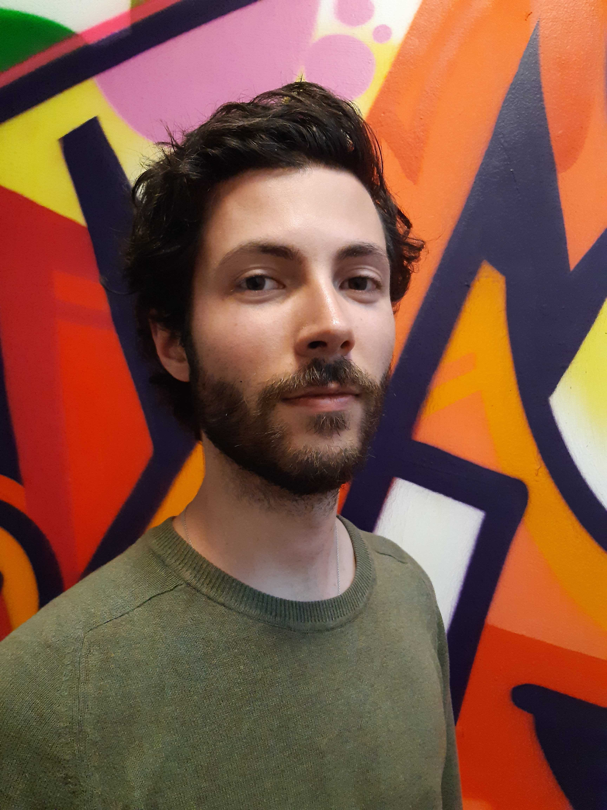

<!--- Logo --->
<link href="https://cdnjs.cloudflare.com/ajax/libs/font-awesome/5.13.0/css/all.min.css" rel="stylesheet">

# Alexandre Lienard  
  

<i class="fas fa-phone-alt"></i> +33 6 78 35 36 59 

<i class="fas fa-envelope"></i><a href="mailto:alienard@student.42.fr" title="alienard@student.42.fr"> alienard@student.42.fr </a>

<i class="fab fa-firefox-browser"></i><a href="https://alienard.fr"> alienard.fr</a>

<i class="fab fa-github"></i><a href="https://github.com/lienardale"> github.com/lienardale</a>

<i class="fab fa-linkedin"></i><a href="https://linkedin.com/in/alienard"> linkedin.com/in/alienard</a>

## Dev Skills
  Proficient :    
  C,      C++,    
  ReactJS,      Bash,    
  Docker,      Git      
    
  Intermediate :    
  Typescript,    NextJS,    
  Postgres,  TypeORM    
    
  Beginner :    
  NestJS,    ExpressJS,    
  MySQL,    Prisma    

## Soft Skills

Stakeholder mgmt   
Adaptability   
Project mgmt   
Crisis mgmt   

## Languages

French (native)  
English (professional)

## Hobbies

Long distance bike travelling   
Graphic Novels  
Podcasts  

# Fullstack web developer   
    
looking for 6 months internship / permanent position  
available now

## Profile

Software developer with a background in marketing.  
Experience in teamwork & project coordination.  
Looking for the company that will make me a better developer.  
Eager to learn through challenging projects and to meet the team I'll grow with.

## Academics

`2019 - now`
__42 Schools of Developers__  
42 network common-core

`2014 - 2017`
__IAE Lille__  
Masters in International Marketing & Communication  

## Work Experience

`2019 - 2022`
__Business Manager - Junior 42 Paris__  
- In charge of business development, I created and improved workflows that resulted in an increase of incoming projects (+78%).
- I also developed, automatized and improved the qualification processes. Which resulted in + 56% prospects converting to clients.
- I recruited, trained and managed 32 people in the fields of business development and project management.

`2018 - 2019`
__Product Manager - ESF Sciences Humaines__  
- Business Strategy (diversify acquisition sources)
- Business Analysis (value chain analysis & - optimisation)
- Digital Marketing (increase traffic & conversion)

`2015 - 2017`
__Marketing Assistant - Denoël__  
- Brand Identity (makeover supervision)
- Sales promotion (product launches & stock valorisation)
- Business analysis (annual budget & costs optimisation)

## PROJECTS
- MULTIPLAYER ONLINE PONG | [Github](https://github.com/lienardale/ft_transcendence), [roland-garrong.fr](https://roland-garrong.fr)
  - Implementing game, chat, identification, and friend requests 
  - Typescript - ReactJs - NestJs - Postgres - Docker - Nginx
  - 5 contributors - 11 702 lines - 926 commits
- WEB SERVER | [Github](https://github.com/lienardale/webserv) 
  - Implementing headers, body, CGI and upload/download handling
  - C++ - Php
  - 3 contributors - 6 604 lines - 405 commits
- RAY_TRACER | [Github](https://github.com/lienardale/mini_rt) 
  - Implementing basic forms, lights (ambient & directive) and shadows
  - C - minilibX
  - solo - 2 253 lines - 53 commits
- SHELL | [Github](https://github.com/lienardale/minishell) 
  - Implementing pipes, redirections, environnement and built-ins 
  - C - Bash
  - 2 contributors -  6061 lines - 357 commits

<!-- ### Footer

Last updated: June 2022 -->

